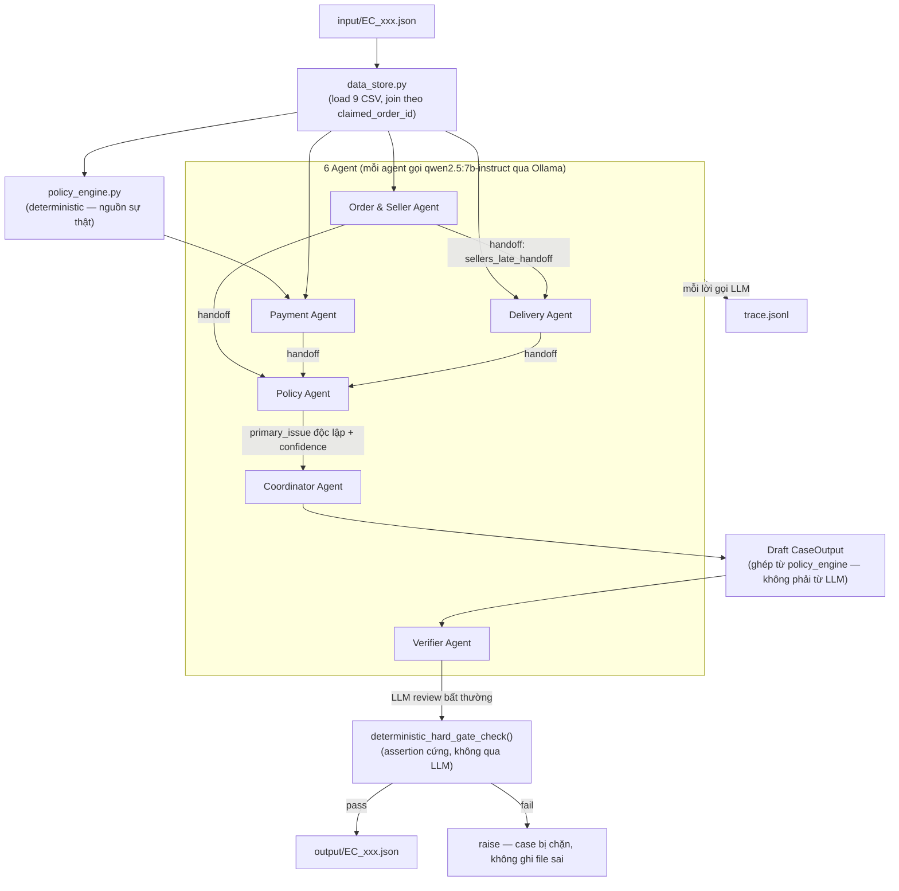

# Kiến trúc hệ thống Multi-Agent Dispute Resolution

## 1. Tổng quan

Hệ thống gồm 6 agent, mỗi agent gọi cùng một model local `qwen2.5:7b-instruct` (≤10B tham số, chạy qua Ollama) cho phần suy luận riêng của mình. Việc **truy xuất dữ liệu và mọi phép tính số học/ID luôn do code Python (pandas) đảm nhiệm** — LLM không bao giờ tự cộng tiền hay tự bịa ID; vai trò của LLM là diễn giải facts, phân loại độc lập và kiểm chứng chéo, đúng tinh thần "ưu tiên dữ liệu có thể kiểm chứng" của đề bài.

## 2. Vai trò từng agent

| Agent | Đọc dữ liệu gì | Việc LLM thực sự làm | Việc code (không qua LLM) đảm bảo |
| --- | --- | --- | --- |
| **Order & Seller Agent** | `orders`, `order_items`, `sellers` (qua `data_store`) | So sánh `order_delivered_carrier_date` với `shipping_limit_date` từng item, liệt kê seller bàn giao trễ, tóm tắt | — |
| **Payment Agent** | `order_payments` + tổng đã tính sẵn bởi code | Đối chiếu tổng payment với tổng item+freight (sai số 0.10 BRL), nhận diện `valid_split_payment` | Tổng `item_total_brl`/`freight_total_brl`/`payment_total_brl` luôn tính bằng `sum()` trong `policy_engine.py` |
| **Delivery Agent** | `orders` (mốc thời gian) + handoff từ Order & Seller Agent | Phân loại timeline: đúng hạn / trễ do seller / trễ do logistics | — |
| **Policy Agent** | Handoff từ 3 agent trên + nội dung khiếu nại khách hàng + bảng luật `EC_POLICY_V1` | Tự phân loại `primary_issue` + `confidence` + rationale, **độc lập** với engine | `policy_engine.apply_policy()` áp đúng bảng ưu tiên README §4 làm **nguồn sự thật cho `primary_issue` cuối cùng**; nếu LLM lệch kết quả, hệ thống log cảnh báo và hạ `confidence` nhưng vẫn giữ kết quả engine |
| **Verifier Agent** | Draft `CaseOutput` + facts gốc | Rà soát bất thường/hallucination (evidence lạ, số liệu vô lý) | `deterministic_hard_gate_check()` chặn cứng: evidence ID đúng định dạng & tồn tại thật trong CSV, cap độ dài list (5/10/3/3/5), `confidence` ∈ [0,1], số tiền khớp giá trị tính lại từ CSV |
| **Coordinator Agent** | Toàn bộ output của 5 agent trên | Tổng hợp bản tóm tắt nội bộ (ghi vào `trace.jsonl`, không thuộc schema output) | Điều phối tuần tự, ghép `CaseOutput` cuối cùng hoàn toàn từ `policy_engine` + facts, ghi file `output/EC_xxx.json` |

## 3. Luồng xử lý 1 case

1. `Coordinator` đọc `input/EC_xxx.json`, lấy `claimed_order_id`.
2. `data_store.get_order_facts()` join `orders` + `order_items` + `order_payments` + `sellers` theo `order_id`/`seller_id`.
3. `policy_engine.apply_policy(facts)` tính `primary_issue`, `responsible_parties`, `root_cause_code`, các tổng tiền, `resolution_actions` — đây là **nguồn sự thật**.
4. `Order & Seller Agent` → `Payment Agent` → `Delivery Agent` chạy tuần tự, mỗi agent nhận facts liên quan + (với Delivery Agent) handoff từ Order & Seller Agent.
5. `Policy Agent` nhận handoff từ 3 agent trên, tự phân loại độc lập; kết quả được đối chiếu với `policy_engine` — nếu khớp thì `confidence` cuối là trung bình của 2 nguồn, nếu lệch thì hạ `confidence` và ghi cảnh báo vào `trace.jsonl` (không đổi `primary_issue`).
6. `Coordinator` ghép `CaseOutput` từ kết quả `policy_engine` (không từ output tự do của LLM).
7. `Verifier Agent` review bằng LLM, sau đó `deterministic_hard_gate_check()` chạy assertion cứng; nếu fail thì case bị chặn (raise) thay vì ghi output sai.
8. Ghi `output/EC_xxx.json`; mọi lời gọi LLM (input, output, model, latency, số lần retry) được ghi vào `trace.jsonl`.

## 4. Vì sao tách "nguồn sự thật tất định" khỏi "suy luận LLM"

Bảng luật README §4 là một cây điều kiện tất định (so sánh `order_status`, timestamp, tổng payment) — hoàn toàn có thể tính đúng 100% bằng code. Vì **case bị hard gate nhận 0 điểm**, thiết kế ưu tiên độ chính xác tuyệt đối cho các phần có thể kiểm chứng (affected_entities, financial_resolution, evidence_ids, root_cause, resolution_actions — 80% trọng số), đồng thời vẫn bắt mỗi agent gọi LLM thật cho đúng yêu cầu "phân công, handoff, kiểm chứng giữa các agent" thay vì gộp toàn bộ xử lý vào một prompt duy nhất.

## 5. Giới hạn model

Mỗi agent dùng chung một model, khai báo cứng trong `src/config.py` (`MODEL_NAME`, `LLM_PROVIDER`) và lặp lại trong `metadata.json`. Hệ thống hỗ trợ 2 provider qua `src/llm_client.py` (chọn bằng `config.LLM_PROVIDER`):

- **Ollama local** (`qwen2.5:7b-instruct` hoặc `qwen2.5:3b-instruct`) — open-weight, công bố rõ số tham số, đảm bảo đúng giới hạn ≤10B của lưu ý #1 README.
- **OpenAI `gpt-4o-mini`** — dùng theo yêu cầu tường minh của người dùng để tăng tốc độ chạy. **Lưu ý quan trọng:** OpenAI không công bố parameter count của model này; các ước tính công khai đều cho rằng nó lớn hơn 10B. Đây là một **sai lệch có chủ đích, đã được ghi nhận trung thực** trong `metadata.json` (`model_parameter_size` ghi rõ "undisclosed by OpenAI...") thay vì bịa số liệu — người chấm bài cần tự đánh giá việc này có chấp nhận được hay không.
